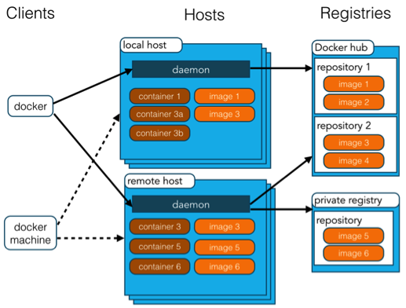

## Docker 知识点整理

### DevOps需要什么？

+ 如今，公司不再发布大量功能，而是尝试将小的功能传输给客户。这有许多优点，如来自客户的快速反馈，更好的软件质量等，从而导致高客户满意度。为了实现这一目标，公司必须：
+ 增加部署频率
+ 降低新版本的故障率
+ 缩短修复之间的准备时间
+ 新版本崩溃时更快的平均恢复时间
+ DevOps满足所有这些需求，并帮助实现无缝的软件交付。

[为什么大公司一定要使用DevOps?](https://www.cnblogs.com/3xmq/p/devops.html)

### DevOps有哪些优势？

技术优势：

+ 持续的软件交付
+ 需要修复不太复杂的问题
+ 更快地解决问题

商业利益：
+ 更快地提供功能
+ 更稳定的操作环境
+ 更多时间可用于增加价值（而不是修复/维护）

### CI（持续集成）服务器的功能是什么？

CI服务器的功能是持续集成不同开发人员对存储库所做的所有更改，并检查编译错误。它需要一天构建几次代码，最好是在每次提交之后，这样它就可以检测出哪一个提交在发生破坏时造成了破坏。

### 什么是docker？

+ Docker是一个容器化平台，它将应用程序及其所有依赖项以容器的形式打包在一起，以确保应用程序在任何环境（无论是开发环境、测试环境还是生产环境）中无缝运行。
+ Docker容器，将一个软件包在一个完整的文件系统中，其中包含运行所需的一切：代码、运行时、系统工具、系统库等任何可以安装在服务器上的东西。
+ 它都将始终运行相同的程序，无论软件的环境如何。

### 如何使用Docker构建与环境无关的系统？

有三个主要功能有助于实现这一目标：

+ 卷
+ 环境变量注入
+ 只读文件系统

### Dockerfile 中的命令 COPY 和 ADD 命令有什么区别？

一般而言，虽然ADD并且COPY在功能上类似，但是首选COPY。

那是因为它比ADD更易懂。COPY仅支持将本地文件复制到容器中，而ADD具有一些功能（如仅限本地的tar提取和远程URL支持），这些功能并不是很明显。因此，ADD的最佳用途是将本地tar文件自动提取到镜像中，如ADD rootfs.tar.xz /。

### 什么是Docker镜像？

Docker镜像是Docker容器的源代码。换句话说，Docker镜像用于创建容器。使用build命令创建镜像，并且在使用run启动时它们将生成容器。镜像存储在Docker注册表中，registry.hub.docker.com因为它们可能变得非常大，镜像被设计为由其他镜像层组成，允许在通过网络传输镜像时发送最少量的数据。

Docker 镜像是 Docker 容器运行时的只读模板，每一个镜像由一系列的层（layers）组成。docker 使用 UnionFS 来将这些层联合到单独的镜像中。

### 什么是 Docker 容器？
Docker容器包括应用程序及其所有依赖项，但与其他容器共享内核，在主机操作系统的用户空间中作为独立进程运行。Docker容器不依赖于任何特定的基础架构：它们可以在任何计算机，任何基础架构和任何云中运行。
容器是一种轻量级、可移植、自包含的软件打包技术，使应用程序可以在几乎任何地方以相同的方式运行。

+ 一个 Docker 容器包含了所有的某个应用运行所需要的环境。
+ 每一个 Docker 容器都是从 Docker 镜像中创建的。
+ 每一个 Docker 容器都是独立和安全的应用平台，Docker 容器是 Docker 的运行部分。

### 什么是 Docker 仓库

+ Docker 仓库用来保存镜像，可以理解为代码控制中的代码仓库。
+ Docker 仓库也有公有和私有的概念。公有的 Docker 仓库是 Docker Hub。

### 什么是 Docker Hub?
Docker hub是一个基于云的注册表服务，允许您链接到代码存储库，构建映像并测试它们，存储手动推送的镜像以及指向Docker云的链接，以便您可以将镜像部署到主机。它为整个开发流程中的容器发现，分发和变更管理，用户和团队协作以及工作流自动化提供了集中资源。

### Docker 容器在任何给定时间点都可以处于什么状态？
在任何给定的时间点，Docker容器都可以有四种状态。如下：

+ 运行
+ 已暂停
+ 重新启动
+ 已退出

### 有没有办法识别Docker容器的状态？

我们可以通过运行命令来识别Docker容器的状态

```
docker ps –a
```

这将依次列出所有可用的docker容器及其在主机上的相应状态。我们可以很容易地识别感兴趣的容器，以相应地检查其状态。

### Dockerfile中最常见的指令是什么？

Dockerfile中的一些常见指令如下：

+ FROM：我们使用FROM为后续指令设置基本镜像。在每个有效的Dockerfile中，FROM是第一条指令。
+ LABEL：我们使用LABEL根据项目，模块，许可等组织我们的镜像。我们也可以使用LABEL来帮助实现自动化。在LABEL中，我们指定一个键值对，以后可用于以编程方式处理Dockerfile。
+ RUN：我们使用RUN命令在当前图像之上的新图层中执行任何指令。使用每个RUN命令，我们在图像上添加一些内容，并在Dockerfile的后续步骤中使用它。
+ CMD：我们使用CMD命令提供执行容器的默认值。在Dockerfile中，如果我们包含多个CMD命令，则只使用最后一条指令。

### 什么类型的应用程序 - 无状态或有状态更适合Docker容器？

最好为Docker Container创建无状态应用程序。我们可以从应用程序中创建一个容器，并从应用程序中取出可配置的状态参数。现在我们可以在生产环境和具有不同参数的QA环境中运行相同的容器。这有助于在不同场景中重用相同的镜像。另外，无状态应用程序比有状态应用程序更容易使用Docker容器进行扩展。

### 解释基本的Docker使用工作流程

+ 一切都从Dockerfile开始。Dockerfile是镜像的源代码。
+ 创建Dockerfile后，您可以构建它以创建容器的镜像。图像只是“源代码”的“编译版本”，即Dockerfile。
+ 获得容器的镜像后，应使用注册表重新分发容器。注册表就像一个git存储库 - 你可以推送和拉取镜像。
+ 接下来，您可以使用该图像来运行容器。在许多方面，正在运行的容器与虚拟机（但没有虚拟机管理程序）非常相似。

```
 +------------+  docker build   +--------------+  docker run -dt   +-----------+  docker exec -it   +------+
    | Dockerfile | --------------> |    Image     | --------------->  | Container | -----------------> | Bash |
    +------------+                 +--------------+                   +-----------+                    +------+
                                     ^
                                     | docker pull
                                     |
                                   +--------------+
                                   |   Registry   |
                                   +--------------+
```

### Docker Image和Layer有什么区别？
Image：Docker镜像是由一系列只读层构建的

Layer：每个层代表Dockerfile中的指令。

下面的Dockerfile包含四个命令，每个命令都创建一个层。
```

FROM ubuntu:15.04
COPY . /app
RUN make /app
CMD python /app/app.py
```
重要的是，每个层只是与之前层的一组差异。

### 什么是虚拟化？

在其构想的形式中，虚拟化被认为是逻辑上划分大型机以允许多个应用程序同时运行的方法。但是，当公司和开源社区能够以某种方式提供处理特权指令的方法，并允许在单个基于x86的系统上同时运行多个操作系统时，情况发生了巨大变化。

实际效果是虚拟化允许您在同一硬件上运行两个完全不同的操作系统。每个客户操作系统都经历了引导，加载内核等所有过程。您可以拥有非常严格的安全性，例如，客户操作系统无法完全访问主机操作系统或其他客户，从而完全混乱。

可以基于虚拟化方法如何模仿客户操作系统的硬件并模拟客户操作环境来对虚拟化方法进行分类。主要有三种类型的虚拟化：

+ 仿真
+ 半虚拟化
+ 基于容器的虚拟化 

### 什么是管理程序

管理程序处理创建用户虚拟机运行的虚拟环境。它监督用户系统，并确保在必要时为客户分配资源。虚拟机管理程序位于物理机和虚拟机之间，并为虚拟机提供虚拟化服务。为了实现它，它拦截虚拟机上的客户操作系统操作，并模拟主机操作系统上的操作。

虚拟化技术的快速发展（主要是在云端），通过允许在一个物理服务器上创建多个虚拟服务器，借助于管理程序（如Xen、VMware Player、KVM等），以及在商品处理器（如Intel VT AN）中集成硬件支持，进一步推动了虚拟化的使用。例如Intel VT和AMD-V。

### 什么是 Docker Swarm

Docker Swarm是Docker的群集管理工具。它将Docker主机池转变为一个虚拟Docker主机。Docker Swarm提供标准的Docker API，任何已经与Docker守护进程通信的工具都可以使用Swarm扩展到多个主机。

### 您将如何监控生产中的Docker？

Docker提供docker stats和docker events等工具来监控生产中的Docker。我们可以使用这些命令获取重要统计数据的报告。

Docker stats：当我们使用容器ID调用docker stats时，我们获得容器的CPU，内存使用情况等。它类似于Linux中的top命令。

Docker events：Docker events是一个命令，用于查看Docker守护程序中正在进行的任务。

一些常见的Docker事件是：attach，commit，die，detach，rename，destroy等。我们还可以使用各种选项来限制或过滤我们感兴趣的事件。

### 如何批量清理临时镜像文件？
可以使用 `sudo docker rmi $(sudo docker images -q -f danging=true)` 命令

### 如何查看镜像支持的环境变量？
使用 `sudo docker run IMAGE env`

### 本地的镜像文件都存放在哪里
于Docker相关的本地资源存放在/var/lib/docker/目录下，其中container目录存放容器信息，graph目录存放镜像信息，aufs目录下存放具体的镜像底层文件。

### 构建Docker镜像应该遵循哪些原则？
整体远侧上，尽量保持镜像功能的明确和内容的精简，要点包括：

尽量选取满足需求但较小的基础系统镜像，建议选择debian:wheezy镜像，仅有86MB大小
清理编译生成文件、安装包的缓存等临时文件
安装各个软件时候要指定准确的版本号，并避免引入不需要的依赖
从安全的角度考虑，应用尽量使用系统的库和依赖
使用Dockerfile创建镜像时候要添加.dockerignore文件或使用干净的工作目录

### 容器退出后，通过docker ps 命令查看不到，数据会丢失么？
容器退出后会处于终止（exited）状态，此时可以通过 docker ps -a 查看，其中数据不会丢失，还可以通过docker start 来启动，只有删除容器才会清除数据。

### 如何停止所有正在运行的容器？
使用docker kill $(sudo docker ps -q)

### 如何清理批量后台停止的容器？
使用docker rm $（sudo docker ps -a -q）

### 如何临时退出一个正在交互的容器的终端，而不终止它？
按Ctrl+p，后按Ctrl+q，如果按Ctrl+c会使容器内的应用进程终止，进而会使容器终止。

### 很多应用容器都是默认后台运行的，怎么查看它们的输出和日志信息？
使用docker logs，后面跟容器的名称或者ID信息

### 使用docker port 命令映射容器的端口时，系统报错Error: No public port ‘80’ published for …，是什么意思？
创建镜像时Dockerfile要指定正确的EXPOSE的端口，容器启动时指定PublishAllport=true

### 可以在一个容器中同时运行多个应用进程吗？
一般不推荐在同一个容器内运行多个应用进程，如果有类似需求，可以通过额外的进程管理机制，比如supervisord来管理所运行的进程

### 如何控制容器占用系统资源（CPU，内存）的份额？
在使用docker create命令创建容器或使用docker run 创建并运行容器的时候，可以使用-c|–cpu-shares[=0]参数来调整同期使用CPU的权重，使用-m|–memory参数来调整容器使用内存的大小。

### 仓库（Repository）、注册服务器（Registry）、注册索引（Index）有何关系？
首先，仓库是存放一组关联镜像的集合，比如同一个应用的不同版本的镜像，注册服务器是存放实际的镜像的地方，注册索引则负责维护用户的账号，权限，搜索，标签等管理。注册服务器利用注册索引来实现认证等管理。

### Docker的配置文件放在那里。如何修改配置？
Ubuntu系统下Docker的配置文件是/etc/default/docker，CentOS系统配置文件存放在/etc/sysconfig/docker

### 如何更改Docker的默认存储设置？

Docker的默认存放位置是/var/lib/docker,如果希望将Docker的本地文件存储到其他分区，可以使用Linux软连接的方式来做。

### Docker与LXC（Linux Container）有何不同？
LXC利用Linux上相关技术实现容器，Docker则在如下的几个方面进行了改进：

移植性：通过抽象容器配置，容器可以实现一个平台移植到另一个平台；
镜像系统：基于AUFS的镜像系统为容器的分发带来了很多的便利，同时共同的镜像层只需要存储一份，实现高效率的存储；
版本管理：类似于GIT的版本管理理念，用户可以更方面的创建、管理镜像文件；
仓库系统：仓库系统大大降低了镜像的分发和管理的成本；
周边工具：各种现有的工具（配置管理、云平台）对Docker的支持，以及基于Docker的Pass、CI等系统，让Docker的应用更加方便和多样化。

### Docker与Vagrant有何不同？
两者的定位完全不同
Vagrant类似于Boot2Docker（一款运行Docker的最小内核），是一套虚拟机的管理环境，Vagrant可以在多种系统上和虚拟机软件中运行，可以在Windows。Mac等非Linux平台上为Docker支持，自身具有较好的包装性和移植性。
原生Docker自身只能运行在Linux平台上，但启动和运行的性能都比虚拟机要快，往往更适合快速开发和部署应用的场景。

### 开发环境中Docker与Vagrant该如何选择？
Docker不是虚拟机，而是进程隔离，对于资源的消耗很少，单一开发环境下Vagrant是虚拟机上的封装，虚拟机本身会消耗资源。

### 如何将一台宿主机的docker环境迁移到另外一台宿主机？
停止Docker服务，将整个docker存储文件复制到另外一台宿主机上，然后调整另外一台宿主机的配置即可

### 查看容器进程ID，比如1234
sudo docker inspect --format='{{. State.pid}}' $container_id
1234

到proc目录下，把对应的网络名字空间文件链接到/var/run/netns,然后通过正常的系统命令查看操作容器的名字空间。

### Docker 的基本架构

Docker 使用客户端-服务器 (C/S) 架构模式，使用远程API来管理和创建Docker容器。

Docker 主要有以下几部分组成：

+ Docker Client 客户端
+ Docker daemon 守护进程
+ Docker Image 镜像
+ Docker Container 容器
+ Docker Registry 仓库

客户端和守护进程：

+ Docker是C/S（客户端client-服务器server）架构模式。
+ docker通过客户端连接守护进程，通过命令向守护进程发出请求，守护进程通过一系列的操作返回结果。
+ docker客户端可以连接本地或者远程的守护进程。
+ docker客户端和服务器通过socket或RESTful API进行通信。

Docker 容器通过 Docker 镜像来创建，容器与镜像的关系类似于面向对象编程中的对象与类。

如图所示基本架构：


1.Docker 镜像(Images)

Docker 镜像是用于创建 Docker 容器的模板。

2.Docker 容器(Container)

容器是独立运行的一个或一组应用。

3.Docker 客户端(Client)

Docker 客户端通过命令行或者其他工具使用 Docker API

4.Docker 主机(Host)

一个物理或者虚拟的机器用于执行 Docker 守护进程和容器。

5.Docker 仓库(Registry)

Docker 仓库用来保存镜像，可以理解为代码控制中的代码仓库。

6.Docker Hub

提供了庞大的镜像集合供使用。

7.Docker Machine

Docker Machine是一个简化Docker安装的命令行工具，通过一个简单的命令行即可在相应的平台上安装Docker，比如VirtualBox、 Digital Ocean、Microsoft Azure。

总之，Docker是一种轻量虚拟化的容器技术，提供类似虚拟机的隔离功能，并使用了一种分层的联合文件系统技术管理镜像，能极大简化环境运维过程，最后看看对应的应用场景。


### Docker的应用场景
1. 作为云主机使用

相比虚拟机来说，容器使用的是一系列非常轻量级的虚拟化技术，使得其启动、部署、升级跟管理进程一样迅速，用起来灵活又感觉跟虚拟机一样没什么区别，所以有些人直接使用Docker的Ubuntu等镜像创建容器，当作轻量的虚拟机来使用。

2. 作为服务使用

如果你仅仅把Docker容器当作一个轻量的固定虚拟机用，那其实只能算是另类用法，Docker容器最重要价值在于提供一整套平台无关的标准化技术，简化服务的部署、升级、维护，只要把需要运维的各种服务打包成标准的集装箱，就可以在任何能运行Docker的环境下跑起来，达到开箱即用的效果，这个特点才是Docker容器风靡全球的根本原因。

+ Web应用服务
+ 持续集成和持续部署

3. 微服务架构使用

如果说上面两种应用场景还不足以体现出与传统的PaaS平台相比的巨大优势的话，那么对微服务的架构这种复杂又灵活的使用场景的无缝支持绝对具有革命意义。


微服务架构将传统分布式服务继续拆分解耦，形成一些更小服务模块，服务模块之间独立部署升级，这些特性与容器的轻量、高效部署不谋而合。

## Docker 镜像操作

#### 下载镜像

```
docker pull [IMAGE_NAME]:[TAG]
```

> 注意：您也可以不显式地指定 TAG, 它会默认下载 latest 标签，也就是下载仓库中最新版本的镜像。这里并不推荐您下载 latest 标签，因为该镜像的内容会跟踪镜像的最新版本，并随之变化，所以它是不稳定的。在生产环境中，可能会出现莫名其妙的 bug, 推荐您最好还是显示的指定具体的 TAG。


如 `docker pull mysql:5.7`


通过下载过程，可以看到，一个镜像一般是由多个层（layer） 组成，类似 `f7e2b70d04ae` 这样的串表示层的唯一 ID。

> PS: 实际上完整的 ID 包括了 256 个 bit, 64 个十六进制字符组成的。

##### 您可能会想，如果多个不同的镜像中，同时包含了同一个层（layer）,这样重复下载，岂不是导致了存储空间的浪费么?

实际上，Docker 并不会这么傻会去下载重复的层（layer）,Docker 在下载之前，会去检测本地是否会有同样 ID 的层，如果本地已经存在了，就直接使用本地的就好了。

##### 另一个问题，不同仓库中，可能也会存在镜像重名的情况发生, 这种情况咋办？

严格意义上，我们在使用 docker pull 命令时，还需要在镜像前面指定仓库地址(Registry), 如果不指定，则 Docker 会使用您默认配置的仓库地址。例如上面，由于我配置的是国内 docker.io 的仓库地址，我在 pull 的时候，docker 会默认为我加上 docker.io/library 的前缀。

如：当我执行 docker pull mysql:5.7 命令时，实际上相当于 docker pull docker.io/mysql:5.7，如果您未自定义配置仓库，则默认在下载的时候，会在镜像前面加上 DockerHub 的地址。

Docker 通过前缀地址的不同，来保证不同仓库中，重名镜像的唯一性。

#### PULL 子命令

命令行中输入：
```
docker pull --help
```
会得到如下信息：
```
[root@iZbp1j8y1bab0djl9gdp33Z ~]# docker pull --help

Usage:  docker pull [OPTIONS] NAME[:TAG|@DIGEST]

Pull an image or a repository from a registry

Options:
  -a, --all-tags                Download all tagged images in the repository
      --disable-content-trust   Skip image verification (default true)
      --help                    Print usage
```
我们可以看到主要支持的子命令有：
```
-a, --all-tags=true|false: 是否获取仓库中所有镜像，默认为否；
--disable-content-trust: 跳过镜像内容的校验，默认为 true;
```

### Docker 查看镜像信息

#### images 命令列出镜像

通过使用如下两个命令，列出本机已有的镜像：
```
docker images
或
docker image ls
```


+ REPOSITORY: 来自于哪个仓库；
+ TAG: 镜像的标签信息，比如 5.7、latest 表示不同的版本信息；
+ IMAGE ID: 镜像的 ID, 如果您看到两个 ID 完全相同，那么实际上，它们指向的是同一个镜像，只是标签名称不同罢了；
+ CREATED: 镜像最后的更新时间；
+ SIZE: 镜像的大小，优秀的镜像一般体积都比较小，这也是我更倾向于使用轻量级的 alpine 版本的原因；

> 注意：图中的镜像大小信息只是逻辑上的大小信息，因为一个镜像是由多个镜像层（layer）组成的，而相同的镜像层本地只会存储一份，所以，真实情况下，占用的物理存储空间大小，可能会小于逻辑大小。

####  使用 tag 命令为镜像添加标签

通常情况下，为了方便在后续工作中，快速地找到某个镜像，我们可以使用 `docker tag` 命令，为本地镜像添加一个新的标签。如下图所示：


为 docker.io/mysql 镜像，添加新的镜像标签 allen_mysql:5.7。然后使用 docker images 命令，查看本地镜像：


可以看到，本地多了一个 allen_mysql:5.7 的镜像。细心的你一定还会发现，allen_mysql:5.7 和 docker.io/mysql:5.7 的镜像 ID 是一模一样的，说明它们是同一个镜像，只是别名不同而已。

`docker tag` 命令功能更像是, 为指定镜像添加快捷方式一样。

#### 使用 inspect 命令查看镜像详细信息

通过 `docker inspect` 命令，我们可以获取镜像的详细信息，其中，包括创建者，各层的数字摘要等。

```
docker inspect docker.io/mysql:5.7
```


docker inspect 返回的是 JSON 格式的信息，如果您想获取其中指定的一项内容，可以通过 -f 来指定，如获取镜像大小：

```
docker inspect -f {{".Size"}} docker.io/mysql:5.7
```

#### 使用 history 命令查看镜像历史
前面的小节中，我们知道了，一个镜像是由多个层（layer）组成的，那么，我们要如何知道各个层的具体内容呢？

通过 docker history 命令，可以列出各个层（layer）的创建信息，如我们查看 docker.io/mysql:5.7 的各层信息：

#### docker search 搜索镜像

#### docker 删除镜像

通过标签删除镜像
```
docker rmi [image] 或 docker image rm [image]
```

支持的子命令如下：
+ -f, -force: 强制删除镜像，即便有容器引用该镜像；
+ -no-prune: 不要删除未带标签的父镜像；

```
docker rmi allen_mysql:5.7
```

通过 id 删除镜像
```
docker rmi docker rmi ee7cbd482336
```

#### 删除镜像的限制

删除镜像很简单，但也不是我们何时何地都能删除的，它存在一些限制条件。当通过该镜像创建的容器未被销毁时，镜像是无法被删除的。

正确的做法应该是：
+ 先删除引用这个镜像的容器；
+ 再删除这个镜像；

#### 清理镜像

我们在使用 Docker 一段时间后，系统一般都会残存一些临时的、没有被使用的镜像文件，可以通过以下命令进行清理：
```
docker image prune
```
它支持的子命令有：

+ -a, --all: 删除所有没有用的镜像，而不仅仅是临时文件；
+ -f, --force：强制删除镜像文件，无需弹出提示确认；

另外，执行完 `docker image prune` 命令后，还是告诉我们释放了多少存储空间！

### docker 创建镜像
Docker 创建镜像主要有三种：

+ 基于已有的镜像创建；
+ 基于 Dockerfile 来创建；
+ 基于本地模板来导入；

#### 基于已有的镜像创建
通过如下命令来创建：
```
docker container commit
```
支持的子命令如下：

+ -a, --author="": 作者信息；
+ -c, --change=[]: 可以在提交的时候执行 Dockerfile 指令，如 CMD、ENTRYPOINT、ENV、EXPOSE、LABEL、ONBUILD、USER、VOLUME、WORIR 等；
+ -m, --message="": 提交信息；
+ -p, --pause=true: 提交时，暂停容器运行。

接下来，基于本地已有的 Ubuntu 镜像，创建一个新的镜像：


首先，让我将它运行起来，并在其中创建一个 test.txt 文件：


命令如下
```
docker run -it docker.io/ubuntu:latest /bin/bash
root@a0a0c8cfec3a:/# touch test.txt
root@a0a0c8cfec3a:/# exit
```

创建完 test.txt 文件后，需要记住标注的容器 `ID: a0a0c8cfec3a`, 用它来提交一个新的镜像(PS: 你也可以通过名称来提交镜像，这里只演示通过 ID 的方式)。

执行命令
```
docker container commit -m "Added test.txt file" -a "Allen" a0a0c8cfec3a test:0.1
```
再次查看本地镜像信息，可以看到新创建的 test:0.1 镜像了：


### 基于 Dockerfile 创建Dockerfile

通过 Dockerfile 的方式来创建镜像，是最常见的一种方式了，也是比较推荐的方式。Dockerfile 是一个文本指令文件，它描述了是如何基于一个父镜像，来创建一个新镜像的过程。

下面让我们来编写一个简单的 Dockerfile 文件，它描述了基于 Ubuntu 父镜像，安装 Python3 环境的镜像：

```
FROM docker.io/ubuntu:latest

LABEL version="1.0" maintainer="Allen <weiwosuo@github>"

RUN apt-get update && \
    apt-get install -y python3 && \
    apt-get clean && \
    rm -rf /var/lib/apt/lists/*
```

创建完成后，通过这个 Dockerfile 文件，来构建新的镜像，执行命令：

```
docker image build -t python:3 .
```

### docker 导出和加载镜像

通常我们会有下面这种需求，需要将镜像分享给别人，这个时候，我们可以将镜像导出成 tar 包，别人直接通过加载这个 tar 包，快速地将镜像引入到本地镜像库。

要想使用这两个功能，主要是通过如下两个命令：

+ docker save
+ docker load

#### 导出镜像
```
docker save -o python_3.tar python:3
```

#### 加载镜像
通过执行如下命令：

```
docker load -i python_3.tar
或
docker load < python_3.tar
```

###  配置镜像加速器
通过修改 daemon 配置文件 `/etc/docker/daemon.json` 来使用加速器：
```
sudo mkdir -p /etc/docker
sudo tee /etc/docker/daemon.json <<-'EOF'
{
  "registry-mirrors": ["https://bjtzu1jb.mirror.aliyuncs.com"]
}
EOF
sudo systemctl daemon-reload
sudo systemctl restart docker
```

### 启动nginx容器（随机端口映射），并挂载本地文件目录到容器html的命令是？
```
docker run -d -P --name nginx2 -v /home/nginx:/usr/share/nginx/html nginx
```

### 进入容器的方法有哪些？

+ 使用 docker attach 命令
+ 使用 exec 命令，例如 `docker exec -i -t 784fd3b294d7 /bin/bash`

### 容器与主机之间的数据拷贝命令是？
docker cp 命令用于容器与主机之间的数据拷贝
主机到容器：
```
docker cp /www 96f7f14e99ab:/www/
```
容器到主机：
```
docker cp 96f7f14e99ab:/www /tmp/
```

### docker 运行结构

+ Docker 使用客户端-服务器(C/S)架构模式，使用远程API来管理和创建Docker容器。

Docker 容器通过 Docker 镜像来创建。
+ C/S 架构 Docker Daemon 作为服务端接受来自客户端的请求，并处理这些请求（创建、运行、分发容器）。客户端和服务端既可以运行在一个机器上，也可通过Socket 或者 restful API 来进行通信。
+ Docker Daemon 一般在宿主主机后台运行，等待接收来自客户端的消息。Docker 客户端则为用户提供一些列可执行命令，用户用这些命令实现跟 Docker daemon 交互。



### Docker 核心技术

#### Cgroup

control groups简称cgroups，是Linux内核提供的一种可以限制、记录、隔离进程组（process groups）所使用的物理资源（如：cpu,memory,IO等等）的机制。最初由google的工程师提出，后来被整合进Linux内核。Cgroups也是LXC为实现虚拟化所使用的资源管理手段，可以说没有cgroups就没有LXC。

cgroups 适用于多种应用场景，从单个进程的资源控制，到实现操作系统层次的虚拟化（OS Level Virtualization）。 Cgroups 提供了一下功能：

+ 限制进程组可以使用的资源数量（Resource limiting ）。比如：memory子系统可以为进程组设定一个memory使用上限，一旦进程组使用的内存达到限额再申请内存，就会出发OOM（out of memory）。
+ 进程组的优先级控制（Prioritization ）。比如：可以使用cpu子系统为某个进程组分配特定cpu share。
+ 记录进程组使用的资源数量（Accounting ）。比如：可以使用cpuacct子系统记录某个进程组使用的cpu时间
+ 进程组隔离（Isolation）。比如：使用ns子系统可以使不同的进程组使用不同的namespace，以达到隔离的目的，不同的进程组有各自的进程、网络、文件系统挂载空间。
+ 进程组控制（Control）。比如：使用 freezer 子系统可以将进程组挂起和恢复。

Cgroups 的使用简单，提供类似文件的接口，在 /cgroup 目录下新建一个文件夹即可新建一个 group，在此文件夹中新建 task 文件，并将 pid 写入该文件，即可实现对该进程的资源控制。

#### Linux Namespace

个人用户实例之间互相隔离，互不影响。一般的硬件虚拟化方法给出的方法是VM，而 LXC 给出的方法是 container，更细一点讲就是 kernel namespace。其中 pid、net、ipc、mnt、uts、user等 namespace 将 container 的进程、网络、消息、文件系统、UTS("UNIX Time-sharing System")和用户空间隔离开。

|Linux Namespace|说明|
| -- | --| 
|pid namespace|不同用户的进程就是通过 pid namespace 隔离开的，且不同 namespace 中可以有相同 pid。所有的 Container 进程在 docker 中的父进程为 docker 进程，每个 container 进程具有不同的 namespace。允许嵌套，可以实现 docker in docker。|
|net namespace|网络隔离是通过 net namespace 实现的，每个 net namespace 有独立的 network devices，IP addres，IP routing tables,/procs/net 目录。docker 默认采用 veth 的方式将 container 中的虚拟网络网卡同 host 上的一个 docker bridge：docker0 连接在一起。|
|ipc namespace|container 中进程交互还是采用 Linux 常见的进程间交互方法 (interprocess communication - IPC), 包括常见的信号量、消息队列和共享内存。然而同 VM 不同，container 的进程间交互实际上还是 host 上具有相同 pid namespace 中的进程间交互，因此需要在IPC资源申请时加入 namespace 信息 - 每个 IPC 资源有一个唯一的 32bit ID。|
|mnt namespace|类似 chroot，将一个进程放到一个特定的目录执行。mnt namespace 允许不同 namespace 的进程看到的文件结构不同，这样每个 namespace 中的进程所看到的文件目录就被隔离开了。同 chroot 不同，每个 namespace 中的container在 /proc/mounts的信息只包含所在namespace的mount point。|
|uts namespace|UTS ("UNIX Time-sharing System") namespace 允许每个 container 拥有独立的 hostname 和 domain name, 使其在网络上可以被视作一个独立的节点而非 Host 上的一个进程。|
|user namespace|每个 container 可以有不同的 user 和 group id，也就是说可以在 container 内部用 container 内部的用户执行程序而而非 Host 上的用户。|


#### UnionFS
联合文件系统（UnionFS）是一种分层、轻量级并且高性能的文件系统，它支持对文件系统的修改作为一次提交来一层层的叠加，同时可以将不同目录挂载到同一个虚拟文件系统下。 

联合文件系统是 Docker 镜像的基础。镜像可以通过分层来进行继承，基于基础镜像（没有父镜像），可以制作各种具体的应用镜像。

#### Aufs
AUFS(Another Union File System)简单说就是一个文件系统，可以把不同的目录联合在一起。这种文件系统不用格式化，直接挂载即可。

+ 支持将不同目录挂载到同一个虚拟文件系统下的文件系统
+ AUFS支持为每一个成员目录设定只读(readonly)、读写(readwrite) 和 写出(whiteout-able) 权限
+ AUFS 里有个类似分层的概念，对 readonly 权限的 branch 可以逻辑上进行修改，通常是把一个 readonly 的分支和一个 writable 的分支 mount 到一起，对 writable 分支实现 copy-on-write 的策略。

AUFS（AnotherUnionFS）就是一种联合文件系统。 AUFS 支持为每一个成员目录（类似 Git 的分支）设定只读（readonly）、读写（readwrite）和写出（whiteout-able）权限, 同时 AUFS 里有一个类似分层的概念, 对只读权限的分支可以逻辑上进行增量地修改(不影响只读部分的)。 
Docker镜像自身就是多个文件层组成，每一层有唯一的编号，可以通过 docker history 来查看一个镜像由哪些层组成

Docker目前通过插件化方式支持多种文件系统后端。Docker 目前支持的联合文件系统包括 OverlayFS, AUFS, Btrfs, VFS, ZFS 和 Device Mapper。

#### Booting in Normal Linux
典型的启动 Linux 需要两个 FS: bootfs + rootfs
bootfs (boot file system) 主要包含 bootloader 和 kernel, bootloader主要是引导加载kernel, 当boot成功后 kernel 被加载到内存中后 bootfs就被umount了。 rootfs (root file system) 包含的就是典型 Linux 系统中的 /dev, /proc,/bin, /etc 等标准目录和文件。

Linux 在启动后，首先将 rootfs 设置为 readonly，进行一系列检查，然后将其切换为 “readwrite” 供用户使用。对于不同的linux发行版, bootfs基本是一致的, 但rootfs会有差别, 因此不同的发行版可以公用bootfs 。

#### 安全性:APPArmor、SELinux、GRSE
安全永远是相对的，这里有三个方面可以考虑Docker的安全特性:
+ 由kernel namespaces和cgroups实现的Linux系统固有的安全标准;
+ Docker Deamon的安全接口;
+ Linux本身的安全加固解决方案,类如AppArmor, SELinux;


【整理】
+ [关于 Docker 镜像的操作，看完这篇就够啦 !](https://www.jianshu.com/p/ef26450abd8b)
+ [一文教您如何通过 Docker 快速搭建各种测试环境](https://www.jianshu.com/p/dd3a075916b5)
+ [Docker 应用及核心技术](https://wenku.baidu.com/view/c4408e34a9114431b90d6c85ec3a87c240288a2a.html)
+ [【容器技术】非常详细的 Docker 命令](https://blog.csdn.net/enweitech/article/details/51735922)


