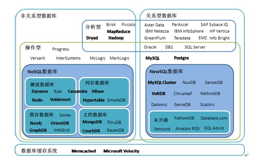
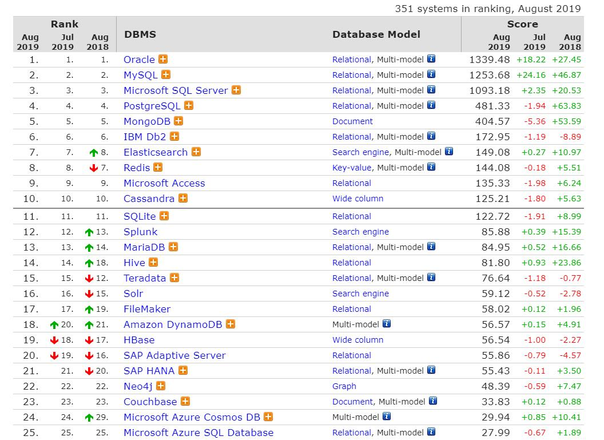
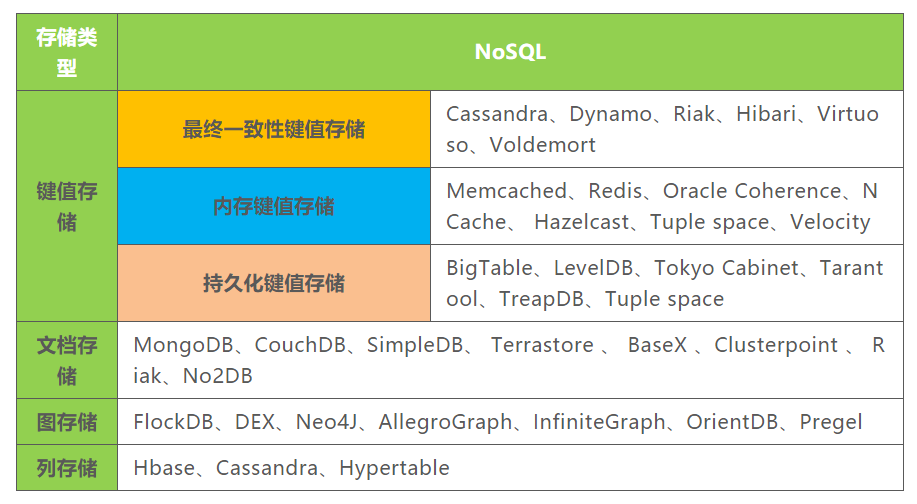
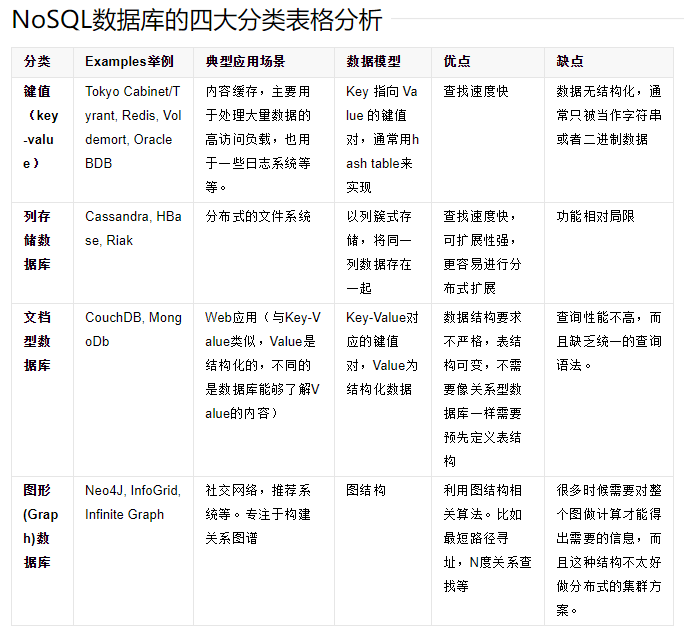
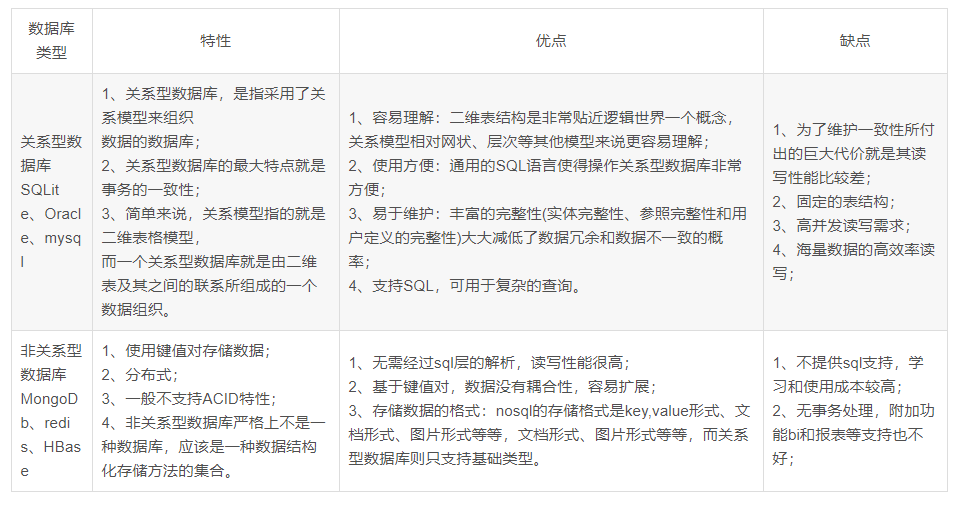
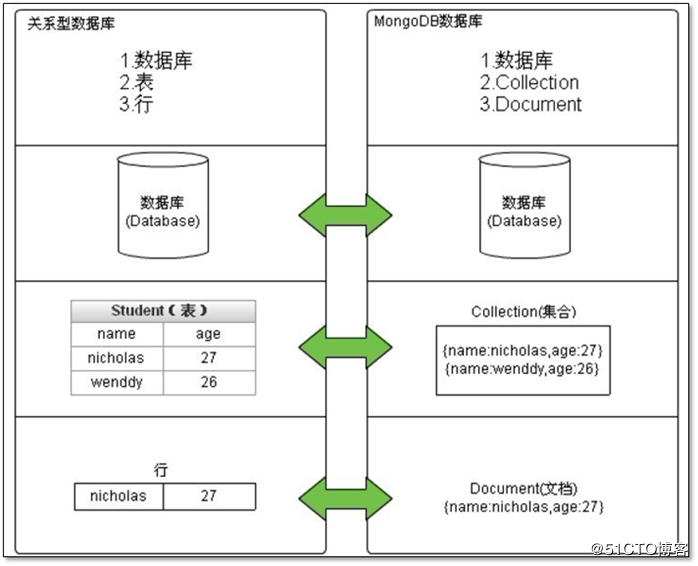

# MongoDB学习笔记

## 1. 数据库管理系统和 NoSQL

<div align="center">  </div><br>

### 1.1 数据库管理系统
+ 数据库管理系统（英语：database management system，缩写：DBMS） 是一种针对对象数据库，为管理数据库而设计的大型电脑软件管理系统
+ 具有代表性的数据管理系统有: Oracle、Microsoft SQL Server、Access、MySQL及PostgreSQL等,通常数据库管理员会使用数据库管理系统来创建数据库系统
+ 现代DBMS使用不同的数据库模型追踪实体,属性和关系,在个人电脑,大型计算机和主机上应用最广泛的数据库管理系统是关系型DBMS,在关系型数据库模型中,用二维表格表示数据库中的数据,这些表格称为关系
+ 数据库管理系统分为两大类:RDBMS（关系型数据库）、Nosql（非关系型数据库）

#### 常见的数据库管理系统

<div align="center">  </div><br>

### 1.2 NoSQL

NoSQL 是对不同于传统的关系数据库的数据库管理系统的统称。

两者存在许多显著的不同点，其中最重要的是NoSQL不使用SQL作为查询语言。其数据存储可以不需要固定的表格模式，也经常会避免使用SQL的JOIN操作，一般有水平可扩展性的特征。

#### NoSQL 数据库四大家族

NoSQL中的四大家族主要是：列存储、键值、图像存储、文档存储，其类型产品主要有以下这些。

<div align="center">  </div><br>

#### NoSQL 之间的对比

<div align="center">  </div><br>

#### NoSQL 的优势

+ 高可扩展性
+ 分布式计算
+ 没有复杂的关系
+ 低成本
+ 架构灵活
+ 半结构化数据

#### NoSQL 和 RDBMS 对比
<div align="center">  </div><br>

## 2. MongoDB 是什么？

MongoDB是一个文档数据库，提供好的性能，领先的非关系型数据库。采用 BSON 存储文档数据。
BSON是一种类json的一种二进制形式的存储格式，简称 Binary JSON.
相对于 json 多了 date 类型和二进制数组。

### 2.1 MongoDB 优势
+ 面向文档的存储：以 JSON 格式的文档保存数据。
+ 任何属性都可以建立索引。
+ 复制以及高可扩展性。
+ 自动分片。
+ 丰富的查询功能。
+ 快速的即时更新。

### 2.2 MongoDB 缺点
+ 多表关联： 仅仅支持 Left Outer Join
+ SQL 语句支持： 查询为主，部分支持
+ 多表原子事务： 不支持
+ 多文档原子事务：不支持
+ 16MB 文档大小限制，不支持中文排序 ，服务端 Javascript 性能欠佳
+ 无事务机制：MongoDB本身没有自带事务机制，如果需要在Mongo中实现机制，需要通过一个额外的表，从逻辑上自行实现事务。


### 2.3 MongoDB 和 关系型数据库术语对比
<div align="center">  </div><br>

### 2.4 MongoDB 适用场景

#### 2.4.1 慎用场景
+ 高度事务性的系统：例如，银行或会计系统。传统的关系型数据库目前还是更适用于需要大量原子性复杂事务的应用程序。
+ 需要参与远程事务，或者需要跨表，跨文档原子性更新的：MongoDB 事务支持仅限于本机的单文档事务
+ 100% 写可用即任何时间写入不能停：MongoDB换主节点时候会有短暂的不可写设计所限

#### 2.4.2 适用场景
+ 网站数据：Mongo非常适合实时的插入，更新与查询，并具备网站实时数据存储所需的复制及高度伸缩性。
+ 缓存：由于性能很高，Mongo也适合作为信息基础设施的缓存层。在系统重启之后，由Mongo搭建的持久化缓存层可以避免下层的数据源 过载。
+ 大尺寸，低价值的数据：使用传统的关系型数据库存储一些数据时可能会比较昂贵，在此之前，很多时候程序员往往会选择传统的文件进行存储。
+ 高伸缩性的场景：Mongo非常适合由数十或数百台服务器组成的数据库。Mongo的路线图中已经包含对MapReduce引擎的内置支持。
+ 用于对象及JSON数据的存储：Mongo的BSON数据格式非常适合文档化格式的存储及查询。

#### 2.4.3 MongoDB 与 MySQL 的区别


||MongoDB|MySQL|
|--|--|--|
|数据库模型|非关系型|关系型|
|存储方式|虚拟内存+持久化|不同的引擎有不同的存储方式|
|查询语句|独特的MongoDB查询|传统 SQL 语句|
|架构特点|可以通过副本集，以及分片来实现高可用|常见有单点，M-S，MHA，MMM，Cluster等架构方式|
|数据处理方式|基于内存，将热数据存在物理内存中，从而达到高速读写|不同的引擎拥有其自己的特点|

## 3 MongoDB常用操作命令大全 

### 3.1 数据库常用命令

#### 3.1.1 Help查看命令提示
```
help
db.help();
db.yourColl.help();
db.youColl.find().help();
rs.help();
```

#### 3.1.2 切换/创建数据库
```
use yourDB;		//当创建一个集合(table)的时候会自动创建当前数据库
```

#### 3.1.3 查询所有数据库
```
show dbs;
```

#### 3.1.4 删除当前使用数据库
```
db.dropDatabase();
```

#### 3.1.5 从指定主机上克隆数据库
```
db.cloneDatabase(“127.0.0.1”);	//将指定机器上的数据库的数据克隆到当前数据库
```

#### 3.1.6 从指定的机器上复制指定数据库数据到某个数据库
```
db.copyDatabase("mydb", "temp", "127.0.0.1"); 	//将本机的mydb的数据复制到temp数据库中
```

####  3.1.7 修复当前数据库
```
db.repairDatabase();
```

#### 3.1.8 查看当前使用的数据库
```
db.getName();		//db; db和getName方法是一样的效果，都可以查询当前使用的数据库
```

#### 3.1.9 显示当前db状态
```
db.stats();
```

#### 3.1.10 当前db版本
```
db.version();
```

#### 3.1.11 查看当前db的链接机器地址
```
db.getMongo();
```

### 3.2 Collection聚集集合

#### 3.2.1 创建一个聚集集合（table）
```
db.createCollection(“collName”, {size: 20, capped: 5, max: 100});	//创建成功会显示{“ok”:1}
db.collName.isCapped();		//判断集合是否为定容量
```

#### 3.2.2 得到指定名称的聚集集合（table）
```
db.getCollection("account");
```

#### 3.2.3 得到当前db的所有聚集集合
```
db.getCollectionNames();
```

#### 3.2.4 显示当前db所有聚集索引的状态
```
db.printCollectionStats();
```
### 3.3 用户相关 

#### 3.3.1 添加一个用户
```
db.addUser("name");db.addUser("userName", "pwd123", true); //添加用户、设置密码、是否只读
```

#### 3.3.2 数据库认证安全模式
```
db.auth("userName", "123123");
```

#### 3.3.3 显示当前所有用户
```
show users;
```

#### 3.3.4 删除用户
```
db.removeUser("userName");
```

### 3.4 聚集集合查询

#### 3.4.1 查询所有记录
```
db.userInfo.find(); 相当于：select* from userInfo;
```

> 默认每页显示20条记录，当显示不下的情况下，可以用it迭代命令查询下一页数据。注意：键入it命令不能带分号，但是你可以设置每页显示数据的大小，用DBQuery.shellBatchSize= 50;这样每页就显示50条记录了。

#### 3.4.2 查询去掉后的当前聚集集合中的某列的重复数据
```
db.userInfo.distinct("name"); //会过滤掉name中的相同数据
相当于 select distict name from userInfo;
```

#### 3.4.3 查询age = 22的记录
```
db.userInfo.find({"age": 22}); 
相当于： select * from userInfo where age = 22;
```

#### 3.4.4 查询age > 22的记录
```
db.userInfo.find({age: {$gt: 22}}); 
相当于：select * from userInfo where age >22;
```
#### 3.4.5 查询age < 22的记录
```
db.userInfo.find({age: {$lt: 22}});
相当于：select * from userInfo where age <22;
```

#### 3.4.6 查询age >= 25的记录
```
db.userInfo.find({age: {$gte: 25}});
相当于：select * from userInfo where age >= 25;
```

#### 3.4.7 查询age <= 25的记录
```
db.userInfo.find({age: {$lte: 25}});
```

#### 3.4.8 查询age >= 23 并且 age <= 26
```
db.userInfo.find({age: {$gte: 23, $lte: 26}});
```

#### 3.4.9 查询name中包含 mongo的数据
```
db.userInfo.find({name: /mongo/});
相当于 select * from userInfo where name like ‘%mongo%';
```

#### 3.4.10 查询name中以mongo开头的
```
db.userInfo.find({name: /^mongo/});
相当于select * from userInfo where name like ‘mongo%';
```

#### 3.4.11 查询指定列name、age数据
```
db.userInfo.find({}, {name: 1, age: 1});
相当于：select name, age from userInfo;
name可以用true或false,当用ture的情况下河name:1效果一样，如果用false就是排除name，显示name以外的列信息。
```

#### 3.4.12 查询指定列name，age数据,age > 25
```
db.userInfo.find({age: {$gt: 25}}, {name: 1, age: 1});
相当于：select name, age from userInfo where age >25;
```

#### 3.4.13 按照年龄排序
```
升序：db.userInfo.find().sort({age: 1});
降序：db.userInfo.find().sort({age: -1});
```

#### 3.4.14 查询name = zhangsan, age = 22的数据
```
db.userInfo.find({name: 'zhangsan', age: 22});
相当于：select * from userInfo where name = ‘zhangsan' and age = ‘22';
```

#### 3.4.15 查询前5条数据
```
db.userInfo.find().limit(5);
相当于：selecttop 5 * from userInfo;
```

#### 3.4.16 查询10条以后的数据
```
db.userInfo.find().skip(10);
相当于：select * from userInfo where id not in (selecttop 10 * from userInfo);
```

#### 3.4.17 查询在5-10之间的数据
```
db.userInfo.find().limit(10).skip(5);	//可用于分页，limit是pageSize，skip是第几页 * pageSize
```

#### 3.4.18 or与 查询
```
db.userInfo.find({$or: [{age: 22}, {age: 25}]}); 
相当于：select * from userInfo where age = 22 or age = 25;
```

#### 3.4.19 查询第一条数据
```
db.userInfo.findOne();
相当于：select * from userInfo limit 1;
```

#### 3.4.20 查询某个结果集的记录条数
```
db.userInfo.find({age: {$gte: 25}}).count();
相当于：select count(*) from userInfo where age >= 20;
```

#### 3.4.21 按照某列进行排序
```
db.userInfo.find({sex ：{$exists：true}}).count();
相当于：select count(sex) from userInfo;
```

### 3.5 索引

#### 3.5.1 创建索引
```
db .userInfo.ensureIndex({name: 1});
db.userInfo.ensureIndex({name: 1, ts: -1});
``` 

#### 3.5.2 查询当前聚集集合所有索引
```
db.userInfo.getIndexes();
```

#### 3.5.3 查看总索引记录大小
```
db.userInfo.totalIndexSize();
```

#### 3.5.4 读取当前集合的所有index信息
```
db.users.reIndex();
```

#### 3.5.5 删除指定索引
```
db.users.dropIndex("name_1");
```

#### 3.5.6 删除所有索引索引
```
db.users.dropIndexes();
```

### 3.6 修改、添加、删除集合数据

#### 3.6.1 添加的数据的数据列没有固定,根据添加的数据为准

```
db.users.save({name: ‘zhangsan', age: 25, sex: true});
```

#### 3.6.2 修改
```
db.users.update({age: 25}, {$set: {name: 'changeName'}}, false, true);
相当于：update users set name = ‘changeName' where age = 25;

db.users.update({name: 'Lisi'}, {$inc: {age: 50}}, false, true);
相当于：update users set age = age + 50 where name = ‘Lisi';

db.users.update({name: 'Lisi'}, {$inc: {age: 50}, $set: {name: 'hoho'}}, false, true);
相当于：update users set age = age + 50, name = ‘hoho' where name = ‘Lisi';

```

#### 3.6.3 删除

```
db.users.remove({age: 132});
```

#### 3.6.4 查询修改删除
```
db.users.findAndModify(
	{
		query: {age: {$gte: 25}},
		sort: {age: -1}, 
		update: {$set: {name: 'a2'}, $inc: {age: 2}}, 
		remove: true
	}
);

db.runCommand(
	{ 
		findandmodify : "users",
		query: {age: {$gte: 25}}, 
		sort: {age: -1}, 
		update: {$set: {name: 'a2'},
		$inc: {age: 2}}, 
		remove: true
	}
);
```

### 3.7 语句块操作 

#### 3.7.1 简单Hello World
```
print("Hello World!");	//这种写法调用了print函数，和直接写入"Hello World!"的效果是一样的
```

#### 3.7.2 将一个对象转换成json
```
tojson(new Object());tojson(new Object('a'));
```

#### 3.7.3 循环添加数据
```
循环添加了30条数据，同样也可以省略括号的写法
for (var i = 0; i < 30; i++) {... 
	db.users.save({name: "u_" + i, age: 22 + i, sex: i % 2}); 
...};
```

```
也是可以的，当你用db.users.find()查询的时候，显示多条数据而无法一页显示的情况下，可以用it查看下一页的信息；
for (var i = 0; i < 30; i++) db.users.save({name: "u_" + i, age: 22 + i, sex: i % 2});
```

#### 3.7.4 find 游标查询

```
这样就查询所有的users信息，同样可以这样写
var cursor = db.users.find();
while (cursor.hasNext()) {
	printjson(cursor.next);
}
```

#### 3.7.5 forEach 迭代循环
```
forEach中必须传递一个函数来处理每条迭代的数据信息
db.users.find().forEach(printjson);
```

#### 3.7.6 将 find 游标当数组处理
```
取得下标索引为4的那条数据既然可以当做数组处理，那么就可以获得它的长度：cursor.length();或者cursor.count();
var cursor = db.users.find();
cursor[4];

那样我们也可以用循环显示数据
for (var i = 0, len = c.length(); i < len; i++) printjson(c[i]);

```
#### 3.7.7 将 find 游标转换成数组
```
用toArray方法将其转换为数组
var arr = db.users.find().toArray();
printjson(arr[2]);
```

#### 3.7.8 定制我们自己的查询结果
```
只显示age<=28的并且只显示age这列数据

db.users.find({age: {$lte: 28}}, {age: 1}).forEach(printjson);

或

db.users.find({age: {$lte: 28}}, {age: true}).forEach(printjson);
```

```
排除age的列
db.users.find({age: {$lte: 28}}, {age: false}).forEach(printjson);
```

#### 3.7.9 forEach 传递函数显示信息
```
db.things.find({x:4}).forEach(
	function(x) {
		print(tojson(x));
	}
);
```

### 3.8 其他
```
db.getPrevError();	//查询之前的错误信息

db.resetError();	//清除错误记录

db.yourColl.help();		//查看帮助

db.yourColl.count();	//查询当前集合的数据条数  

db.userInfo.dataSize(); //查看数据空间大小

db.userInfo.getDB();	//得到当前聚集集合所在的db

db.userInfo.stats();  //得到当前聚集的状态

db.userInfo.totalSize(); //得到聚集集合总大小

db.userInfo.storageSize(); //聚集集合储存空间大小

db.userInfo.getShardVersion(); //Shard版本信息

db.userInfo.renameCollection("users");  //聚集集合重命名,将userInfo重命名为users

db.userInfo.drop();		//删除当前聚集集合

show dbs; //显示数据库列表

show collections //显示当前数据库中的集合（类似关系数据库中的表）

show users //显示用户 use <db name>：切换当前数据库，这和MS-SQL里面的意思一样

db.help()  //显示数据库操作命令，里面有很多的命令

db.foo.help() //显示集合操作命令，同样有很多的命令，foo指的是当前数据库下，一个叫foo的集合，并非真正意义上的命令

db.foo.find() //对于当前数据库中的foo集合进行数据查找（由于没有条件，会列出所有数据） 

db.foo.find({a:1})  //对于当前数据库中的foo集合进行查找，条件是数据中有一个属性叫a，且a的值为1
```


【学习资料】

+ [关系型数据库与非关系型数据库的简介、对比和说明！！！](https://blog.csdn.net/Guijun6/article/details/81205767)
+ [MongoDB面试题](https://www.cnblogs.com/angle6-liu/p/10791875.html)


