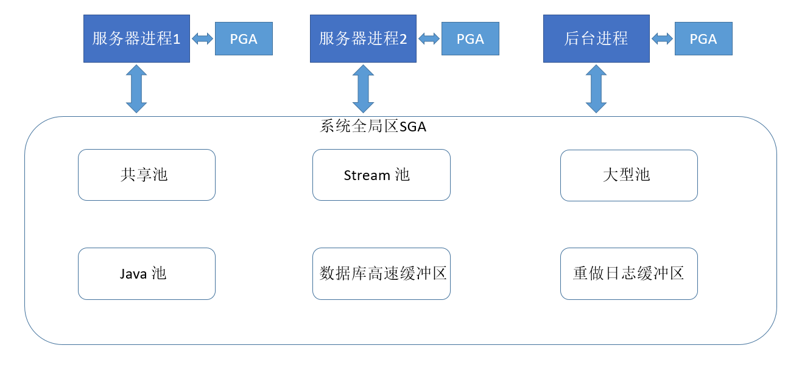

# Oracle 数据库复习

## 1. Oracle 概要

### 1.1 Oracle 的体系结构

+ Oracle 有三种类型的文件：
    + 数据库文件：存储实际数据
	+ 控制文件：存储有关数据库状态的信息
	+ 重做文件：记录了所有对用户对象和系统对象所做的变更
+ Oracle 有两种实例类型：
    + 单进程实例
    + 多进程实例(两种)：用户进程、Oracle进程

> 注：Oracle 中四个必须启动的后台进程是：DBWR（数据库写）、 LGWR（日志写）、 SMON（系统监控）、 PMON（进程监控）。

    	
**说明**

操作系统为上述进程分配的内存结构有两部分：
+ 系统全局区（System Global Area,SGA） 

运行在客户机上的用户进程和运行在服务器上的服务器进程是同时运行的，操作系统将为这些进程分配专有的内存区域用于它们之间的通信，这个专有的内存区就叫系统全局区。

	
+ 程序全局区（Program Global Area,PGA）。
PGA是存储区中被单个用户进程所用的内存区域，是用户进程私有的，不能共享。主要存放的是单个进程工作时需要的数据和控制信息，其中包括进程会话变量和内部数据等。

<div align="center">  </div><br>
	
在系统全局区里根据其**功能**的不同，分为以下主要部分：
+ 数据块缓冲区
+ 重做日志缓冲区
+ SQL共享池
+ 字典缓冲区
+ ......

### 1.2 SQL *Plus 环境

`SQL*Plus` 是 Oracle 数据库管理员和普通用户最常用的实用程序之一，它提供一个交互式 SQL 语句、`PL/SQL` 语句块和 `SQL* Plus` 命令的编辑、编译和执行环境。普通用户使用它可以实现各种数据库操作之外，还能够完成数据库启动、关闭和恢复等管理工作。`SQL*Plus Worksheet` 同 `SQL*Plus` 一样，也是用于执行大多数 SQL 命令和查询语句的工具。其改进的地方主要在于 Window 风格上，`SQL*Plus Worksheet` 功能上可以完全兼容`SQL*Plus`，界面上更容易操作。

#### 训练1： 输入和执行CONNECT命令重新连接数据库:
```
步骤1：在输入区域清除原有命令，输入新命令。
CONNECT 用户名/密码@oracle9

步骤2：点击“执行”按钮(或按F5快捷键)执行该命令。

```

说明：账户名和口令之间用“/”分隔。“@”后面的字符串称为网络服务名或称为连接字符串。
注意：以上方法的口令是显式的，容易被其他人窃取。

要关闭或退出 `SQL*Plus Worksheet`，可以在输入区域直接输入“EXIT”或“QUIT”命令并执行，或执行“文件”菜单下的“退出”命令。
注意：进入SQL`*Plus Worksheet`界面后，首先把输入区域的命令`Connect Username/****@oracle9`删除。因为每次按“执行”按钮或 F5 时，所有在输入区域的命令都会被执行，为了不重复执行连接命令，应该把它删除。

#### 建立样本数据库
```
CREATE TABLE DEPT
       (DEPTNO NUMBER(2) CONSTRAINT PK_DEPT PRIMARY KEY,
	DNAME VARCHAR2(14) ,
	LOC VARCHAR2(13) ) ;
	
INSERT INTO DEPT VALUES (10,'ACCOUNTING','NEW YORK');
INSERT INTO DEPT VALUES (20,'RESEARCH','DALLAS');
INSERT INTO DEPT VALUES (30,'SALES','CHICAGO');
INSERT INTO DEPT VALUES (40,'OPERATIONS','BOSTON');
	
CREATE TABLE EMP
       (EMPNO NUMBER(4) CONSTRAINT PK_EMP PRIMARY KEY,
	ENAME VARCHAR2(10),
	JOB VARCHAR2(9),
	MGR NUMBER(4),
	HIREDATE DATE,
	SAL NUMBER(7,2),
	COMM NUMBER(7,2),
	DEPTNO NUMBER(2) CONSTRAINT FK_DEPTNO REFERENCES DEPT);
	
INSERT INTO EMP VALUES (7369,'SMITH','CLERK',7902,to_date('17-12-1980','dd-mm-yyyy'),800,NULL,20);
INSERT INTO EMP VALUES (7499,'ALLEN','SALESMAN',7698,to_date('20-2-1981','dd-mm-yyyy'),1600,300,30);
INSERT INTO EMP VALUES (7521,'WARD','SALESMAN',7698,to_date('22-2-1981','dd-mm-yyyy'),1250,500,30);
INSERT INTO EMP VALUES (7566,'JONES','MANAGER',7839,to_date('2-4-1981','dd-mm-yyyy'),2975,NULL,20);
INSERT INTO EMP VALUES (7654,'MARTIN','SALESMAN',7698,to_date('28-9-1981','dd-mm-yyyy'),1250,1400,30);
INSERT INTO EMP VALUES (7698,'BLAKE','MANAGER',7839,to_date('1-5-1981','dd-mm-yyyy'),2850,NULL,30);
INSERT INTO EMP VALUES (7782,'CLARK','MANAGER',7839,to_date('9-6-1981','dd-mm-yyyy'),2450,NULL,10);
INSERT INTO EMP VALUES (7788,'SCOTT','ANALYST',7566,to_date('19-4-87','dd-mm-rr')-85,3000,NULL,20);
INSERT INTO EMP VALUES (7839,'KING','PRESIDENT',NULL,to_date('17-11-1981','dd-mm-yyyy'),5000,NULL,10);
INSERT INTO EMP VALUES (7844,'TURNER','SALESMAN',7698,to_date('8-9-1981','dd-mm-yyyy'),1500,0,30);
INSERT INTO EMP VALUES (7876,'ADAMS','CLERK',7788,to_date('23-5-87', 'dd-mm-rr')-51,1100,NULL,20);
INSERT INTO EMP VALUES (7900,'JAMES','CLERK',7698,to_date('3-12-1981','dd-mm-yyyy'),950,NULL,30);
INSERT INTO EMP VALUES (7902,'FORD','ANALYST',7566,to_date('3-12-1981','dd-mm-yyyy'),3000,NULL,20);
INSERT INTO EMP VALUES (7934,'MILLER','CLERK',7782,to_date('23-1-1982','dd-mm-yyyy'),1300,NULL,10);

CREATE TABLE SALGRADE
      ( GRADE NUMBER,
	LOSAL NUMBER,
	HISAL NUMBER );
	
INSERT INTO SALGRADE VALUES (1,700,1200);
INSERT INTO SALGRADE VALUES (2,1201,1400);
INSERT INTO SALGRADE VALUES (3,1401,2000);
INSERT INTO SALGRADE VALUES (4,2001,3000);
INSERT INTO SALGRADE VALUES (5,3001,9999);
COMMIT;
```

#### 设置输出页面大小
```
步骤1：输入并执行以下命令，观察显示结果：
	SELECT * FROM emp;
步骤2：在输入区输入并执行以下命令：
	SET PAGESIZE 100 
	SET LINESIZE 120 
	或
	SET PAGESIZE 100 LINESIZE 120 
步骤3：重新输入并执行以下命令，观察显示结果：
	SELECT * FROM emp;
说明：命令SET PAGESIZE 100将页高设置为100行，命令SET LINESIZE 120将页宽设置为120个字符。通过页面的重新设置，消除了显示的折行现象。
```
注意：每次重新启动 `SQL*Plus Worksheet`，这些环境变量都会变为系统默认值。

#### 显示当前用户
```
SHOW USER
```
#### 使用 Spool 命令记录操作内容
```
步骤1：执行命令：
	SPOOL C:\TEST
	步骤2：执行命令：
	SELECT * FROM emp; 
步骤3：执行命令：
	SELECT * FROM dept;
步骤4：执行命令：
	SPOOL　OFF
步骤5：用记事本打开C:\TEST.LST并查看内容：

```

#### 1.2.2 认识表的结构
样本数据库里 EMP 表存储公司雇员的信息，DEPT 存储公司部门信息。

表：用来存储二维信息，由行和列组成。行一般称为表的记录，列称为表的字段。

Oracle 常用的表字段数据类型有：
+ CHAR：固定长度的字符串，没有存储字符的位置，用空格填充。
+ VARCHAR2：可变长度的字符串，自动去掉前后的空格。
+ NUMBER(M, N)：数字型，M是位数总长度, N是小数的长度。
+ DATE：日期类型，包括日期和时间在内。
+ BOOLEAN：布尔型，即逻辑型。

说明：	可以使用 DESCRIBE 命令(DESCRIBE可简写成 DESC)来检查表的结构信息。


##### 显示 EMP 表的结构
```
DESCRIBE emp

名称                                              是否为空?  类型
----------------------------------------------------------------------------------------------------------------------
 EMPNO                                          NOT NULL  NUMBER(4)
 ENAME                                                     VARCHAR2(10)
 JOB                                                         VARCHAR2(9)
 MGR                                                        NUMBER(4)
 HIREDATE                                                   DATE
 SAL                                                         NUMBER(7,2)
 COMM                                                      NUMBER(7,2)
 DEPTNO                                                     NUMBER(2)

```
该表有 8 个字段（列）：
+ EMPNO 是雇员编号，数值型，长度为 4 个字节，不能为空。
+ ENAME 是雇员姓名，字符型，长度为 10 个字节，可以为空。
+ JOB 是雇员职务，字符型，长度为 9 个字节，可以为空。 
+ MGR 是雇员经理的编号，数值型，长度为 4 个字节，可以为空。
+ HIREDATE 是雇员雇佣日期，日期型，可以为空。
+ SAL 是雇员工资，数值型，长度为 7 个字节，小数位有 2 位，可以为空。
+ COMM 是雇员津贴，数值型，长度为 7 个字节，小数位有 2 位，可以为空。
+ DEPTNO 是雇员所在的部门编号，数值型，长度为 2 个字节的整数，可以为空。

#### 1.2.3 显示表的内容

##### 显示 emp 表的全部记录
```
select * from emp;
```

