[TOC]

## 背景

1、OSI（Open System Interconnect），即开放式系统互联。 一般都叫OSI参考模型，是ISO（国际标准化组织）组织在1985年研究的网络互联模型。 

2、TCP/IP协议栈是美国国防部高级研究计划局计算机网（ARPANET）和其后继因特网使用的参考模型。ARPANET是由美国国防部赞助的研究网络。最初，它只连接了美国境内的四所大学。随后的几年中，它通过租用的电话线连接了数百所大学和政府部门。最终ARPANET发展成为全球规模最大的互连网络-因特网。最初的ARPANET于1990年永久性地关闭。　　 

3、ISO制定的OSI参考模型的过于庞大、复杂招致了许多批评。与此对照，由技术人员自己开发的TCP/IP协议栈获得了更为广泛的应用。

## TCP/IP 参考模型

### 1 体系结构和主要协议

现在的Internet的主流协议族为 TCP/IP协议族，这是一个分层、多协议的通信体系。

 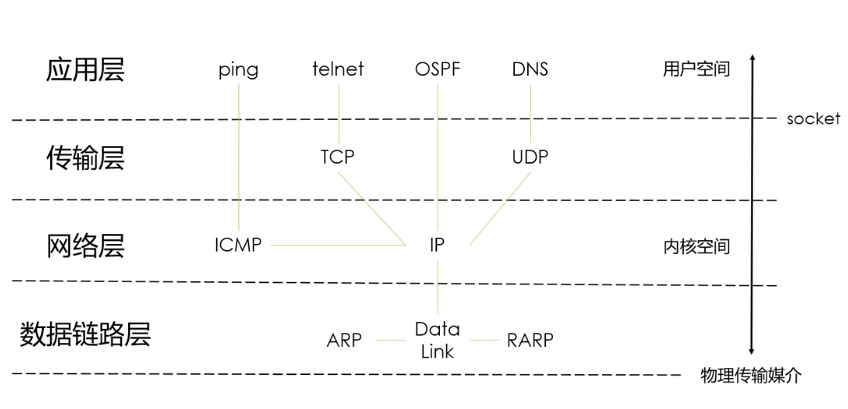 
 

+ 上层协议使用下层协议所提供的服务，物理传输媒介可以当成网线。
+ 应用层如何与内核空间的传输层进行联系呢？是通过 socket 套接字来完成的。

物理链路层：网卡接口的网络驱动程序，处理数据在物理传输媒介上的传输。不同的物理网络具有不同的电器特性。网络驱动程序隐藏了这些细节，为上层协议提供了一个统一的接口。因为网卡不是只由一个生产商提供的。里面的内容包括它交换的数据格式也是不一样的，所以就需要这样一个驱动程序来充当翻译官的角色。

## 两个协议：ARP、RARP

ARP 协议：Address Resolve Protocol, 地址解析协议
RARP 协议：Reverse Address Resolve Protocol，逆地址协议
 

 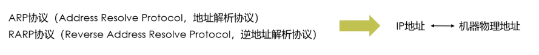 
 
 
这两个协议分别负责IP地址和物理地址的解析和逆解析。
 

 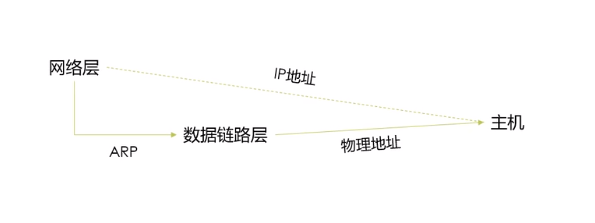 
 
 
网络层是一个自下而上的协议，网络层是不可能直接连接主机的，需要通过数据链路层，但其沟通的语言不同，需要通过ARP进行翻译。网络层首先将IP地址从ARP来广播。知道主机的物理地址后数据链路层再通过物理地址来锁定这个主机。

网络层：数据包的选路和转发

 

 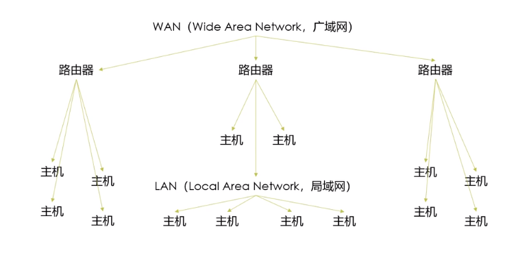 
 
 
 现在的广域网WAN通常使用非常多的分级路由器，来进行连接分散的主机或者是局域网LAN。所以，通信的两台主机并不是直接连接的。而是通过非常非常多的中间节点。也就是路由器来控制的。网络层的任务就是选择这些中间的节点确定两台主机之间的通讯路径。网络层对上层协议也隐藏了这些网络的拓扑连接的细节。使得传输层和网络的应用程序来看，这两个又是直连的。
 
 网络层最核心的协议是IP协议。
 IP 协议(Internet Protocol,因特网协议)：根据数据包的目的IP地址决定如果投递信息
 
 根据数据包的目的和 IP 地址决定如何进行投递这个信息。如果数据没法直接发送给目标主机，那么IP协议就为它寻找合适的下一跳路由器。
 
 
 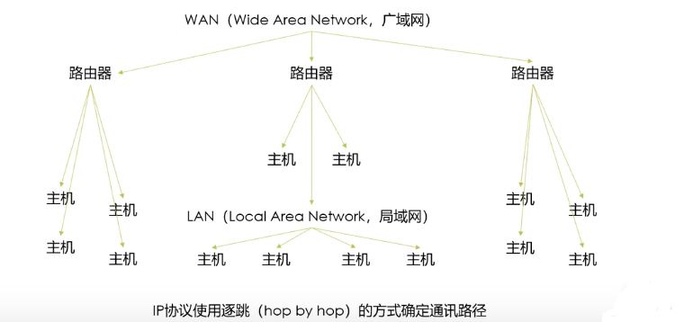 
 
   
 Ip协议通过**逐跳**的方式来确定通讯路径。然后将数据包交给该路由器进行转发。多次分重复这一过程，最终到达目标的主机或者由于发送失败而被丢弃。
   
 
 ICMP 协议(Internet Control Message Protocol,因特网控制报文协议)：检测网络连接
 
 ICMP 协议用于检测网络的连接，他是 IP 协议非常重要的补充。
 
  
 
 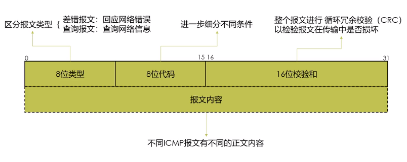 
 
 
+ 传输层为两台主机上的应用程序提供了端对端的通讯。
+ 传输层只关心通信的起始端和目的端，并不在乎数据包的中转过程。
+ 传输层为两台主机上的应用程序提供了端对端的通讯。

 
 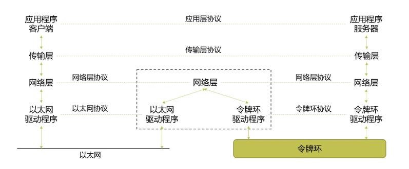 
 

从这里可以看出数据链路层也就是驱动程序封装了物理网络的连接细节，网络层封装了网络连接的细节，传输层为应用程序封装了一条端对端的逻辑通信的链路，他负责收发还有链路的超时重连之类的。

传输层的协议主要有三个: TCP协议、UDP协议和SCTP协议

+ TCP协议(Transmission Control Protocol,传输控制协议)：为应用层提供可靠的、面向连接的、基于流（stream
的服务。

+ UDP协议(User Control Transmission Protocol, 用户数据协议)：为应用层提供不可靠、无连接、基于数据报的服务。

+ SCTP协议(Stream Control Transmission Protocol, 流控制传输协议)：为在因特网上传输电话信号而设计的服务。

TCP协议使用了**超时重传**数据确认的方式来确定数据包能正确发送到目的端，所以TCP服务是非常可靠的。通信的双方必须先建立TCP连接并在内核中保持维持连接的数据结构，比如连接的状态读写缓冲区还有定时器之类的。通讯结束的时候必须双方先关闭这些链接释放内核数据，它是基于流的，它的长度没有限制，源源不断的从通信的另一端流入另一端。

UDP协议则相反，提供了不可靠的服务。如果数据在中途丢失或者发现错误丢失的话，只是简单的通知应用程序而不进行数据确认和超时重传的这个任务。所以就需要用户或者程序员来自行的去判断这些东西。每个UDP的数据报都有一定的数据长度，接收端必须按照该长度为最小的单位将其所有的数据一次性的读出。否则数据将被截断。

应用层负责处理应用程序的逻辑，它的协议有非常非常的多。例如：

+ Ping 应用程序，利用ICMP报文检测网络连接

+ Telnet远程登录协议，在本地完成远程任务

+ OSPF(Open Shortest Path First, 开放最短路径优先)动态路由更新协议，用于路由器之间的通信

+ DNS(Domain Name Service, 域名服务)协议，提供机器域名到IP地址的转换功能。

说明：

+ 应用层协议可能跳过传输层从而直接使用网络层提供的服务
+ 应用层协议通常可以使用TCP服务，也可以使用UDP服务

## 封装

通过封装来使上层协议使用下层协议提供的服务。

 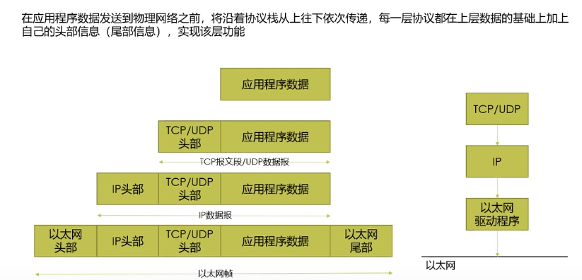 
 

这个图片展示的过程即为封装。TCP报文也就是经过TCP封装后的数据。

 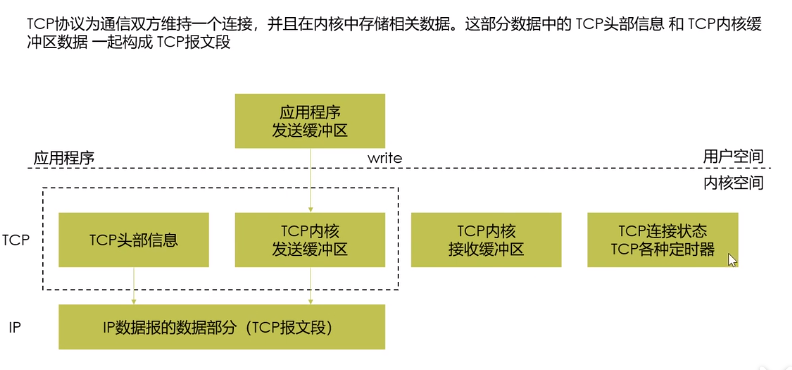 
 

因为 TCP 是可靠的，所有需要存储一些相关的数据（TCP连接状态），应用程序通过 write 或者是 send 来向用户空间到内核空间发送数据。

UDP 数据报为经过 UDP 封装之后的数据。

 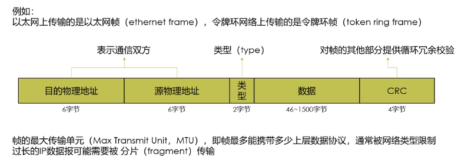 
 

## 帧

经过数据链路层封装的数据。传输的媒介不同，帧的类型也就不同。比如说以太网上传输的是以太网帧，令牌网上传输的是令牌网帧。

 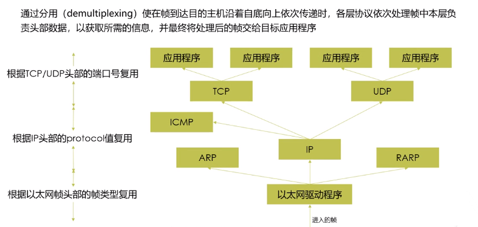 
 

## 分用

通过分用（demultiplexing)使在帧到达目的主机沿着自底向上依次传递时，各层协议依次处理帧中本层负责头部数据，以获取所需的信息，并最终将处理后的帧交给目标应用程序

 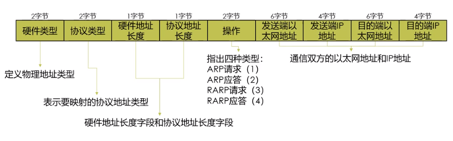 
 

因为 IP 协议、ARP 协议和 RARP 协议都是通过帧来传输数据的，所以帧的头部需要提供某个字段来区分它们。比如说以太网帧，用两个字节的类型来标识上层的协议。因为 ICMP 协议、TCP 协议和 UDP 协议都使用IP协议。所以 IP 数据报的头部采用16位的协议字段来区分它们。TCP 的报文段和 UDP 的报文段则通过头部 16 位的端口号字段来区分上层的协议。比如，DNS 对应的端口号是 53，而 HTTP 的协议是 80，那么，帧通过上述的分用的步骤之后，最终将封装的原始数据发送到目标的服务。在顶层的目标服务来看，封装和分用并没有发生过。

## ARP

实现任意网络层地址到任意物理层地址的转换。
主机向自己所在网络广播一个ARP请求，请求中包含目标机器网咯地址。这个网络上的其他所有机器都会收到这个请求，但只有被请求的目标机器会应答一个ARP应答，其中包含自己的物理地址。

  
 

发送端填充除了目的端的以太网地之外的其他三个字段构建ARP请求并发送，而接收端发现该请求目的端的IP地址就是自己，所以就把自己的以太网地址填进去。然后交换这个目的地址和两个发送端的地址，构建了ARP的应答后返回，并且把操作的这个字段设置为 2 ARP 应答。
ARP维护一个高速缓存，其中包含经常访问或最近访问的机器IP地址到物理地址的映射。这是一个非常有效率的解决方案，把经常访问和最近访问的东西存起来，这样就不用每一次都要把这个广播出去，以减缓时间提高效率。
注意两个问题：

+ ARP应答和请求从以太网驱动程序发出
+ 路由器也会收到ARP请求

## DNS
域名服务，将机器域名转成IP地址。两台机器之间唯一识别对方的标识就是IP地址，如何通过域名访问找到对用的IP地址呢？就需要DNS的转化。

 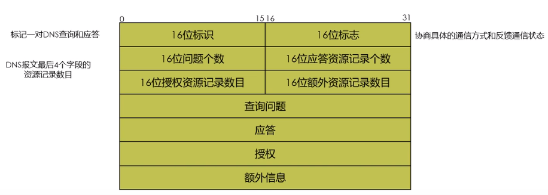 
 

标识字段：协商具体的通信方式和反馈通信状态

 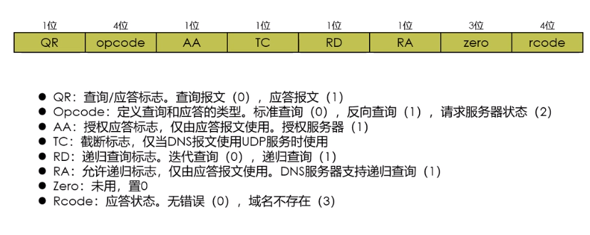 
 

##  DNS查询问题的格式

 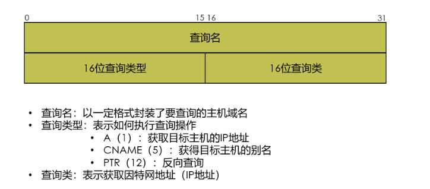 
 

资源记录(Resource Record, RR)格式：被用于应答字段、授权字段和额外信息字段

 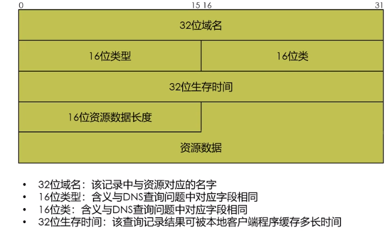 
 

## IP 协议

IP 协议是 TCP/IP 协议族的动力，它为上层协议提供无状态、无连接、不可靠的服务。

### 1 IP 服务的特点

#### 无状态
IP 通信双方不同步传输数据的状态信息，因此所有 IP 数据报的发送、传输和接受都是相互独立、没有上下文关系的

缺点：
（1）无法处理乱序
（2）无法处理重复的 IP 数据段

比如发送端发送出的第 N 个 IP 数据报，可能比第 N+1 个 IP 数据报后到达这个接收端，而同一个 IP 数据报也可能经过不同的路径多次到达接收端。在两种情况下 IP 模块就无法检测到乱序和重复，因为没有任何的上下文关系。接收端的IP数据模块只要接收到了完整的数据报。就会将其数据部分交给上层协议，那么上层协议看来是乱序的、重复的。面向连接的协议，比如 TCP 协议，就能够自己处理乱序、重复的报文段。它递交给上层协议内容绝对是有序的、正确的。虽然 IP 数据报的头部提供了一个标志字段，用来标识唯一的一个 IP 数据报。但是是用来处理 IP 分片和重组的。并不是用来指示接收顺序的。

那么无状态的优点也显而易见，简单、高效。我们无需为保证通信的状态而分配一些内核资源。也无需每次传输数据的时候携带一些状态的信息。其实在协议里面，无状态非常的常见。比如 UDP 协议和 HTTP 协议。

那么，无连接是指IP通信双方都不长久地维持双方的任何信息，这样在上层协议每次发送数据的时候都必须要指定每个对方的这个 IP 地址；不可靠是指IP协议不能保证数据包准确的到达接收端。他只是承诺尽最大的努力，因为很多情况都能导致这个发送失败。比如中转路由器发现 IP 数据报存活时间太长，也就是 TTL 这个字段太长。那么就会丢弃并返回一个 ICMP 的错误信息。也就是超时错误给发送端。所以说，IP 服务的上层协议，需要自己实现数据确认、超时重传等机制以达到可靠传输的目的。

### IP 头部结构

IP 头部信息出现在每个 IP 数据报中，用于指定 IP 通信的源端IP地址、目的端IP地址，指导 IP 分片和重组，以及指定部分通信行为。

### IPV4 头部结构

 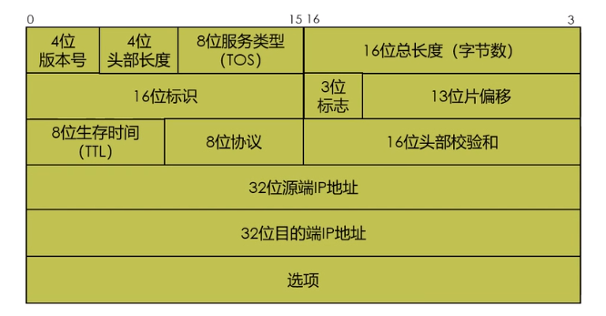 
 

4 位版本号指定 IP 协议的版本，对 Ipv4 来说是 4，其他的是有不同的版本号。4 位头部的长度，是标识 IP 头部有多少个 32 位字，也就是四字节，8 位服务类型 TOS，包括一个3位的优先权字段，现在已经被忽略了这个。4 位的 TOS 字段和一个保留的字段，保留字段必须要置 0。4 位的 TOS 字段分别表示最小延迟、最大吞吐量、最高可靠性和最小费用。其中最多有一个能置为1。16 位的总长度是整个IP数据报的长度。因此 IP 数据报最大的长度单位是 65535 字节，也就是2的16次方减1个字节。

但由于 MTU 的限制，数据报都会被分片传输，接下来的3个字段来标识如何进行分片。那么三位标识字段，这个 16 位的标识字段是标识主机发送的每个数据报。初始值由系统随机生成，每发送一个数据报，值加1，三位的标识字段的第一位保留，第二位DF表示禁止分片。如果设置了这个位的话 IP 的这个模块就不会对数据报进行分片。在这种情况下如果 IP 数据报长度超过了 MTU 的话，将会丢弃数据报并返回一个差错报文。第三部分 MF 表示更多分片。除了最后一个分片之外，其他分片都要置 1。13 位的片偏移是分片相对原始IP数据报开始处的偏移。实际的偏移值是该值左移3位也就是乘 8 之后得到的。8 位的生存时间（TTL）的指数据报到达目的地址前允许经过的路由器的跳数，常见的数值是 64，每经过一个路由就会被路由器减1。到 0 的时候就会丢弃并返回一个差错报文。这个东西可以防止它陷入路由循环。8 位的协议用来区分上层的协议。其中 ICMP 是 1，TCP 是 6，UDP 是 17。16 位的头部校验和由发送端填充。接收端对其使用 CRC 的算法以检验头部是否损坏。注意这个部分是仅检验头部。32位的源端IP地址和目的端IP地址用来标识发送端和接收端。一般情况下保持不变。它的最后一个字段的选项字段，是可变长的可选信息最多包含44字节。

它的可选项包括，记录路由，告诉数据报途径的所有路由器都将自己的IP地址填入头部的选项部分。这样就可以跟踪传输途径，时间戳，告诉每个路由器都将数据报被转发的时间填入选项部分，以测量传输时间。松散源路由选择制定一个路由器的IP地址列表。数据报发送过程中必须严格经过所有的路由器。严格源路由器是和那个前面的相类似。不过是数据报只能经过指定的路由器。

### IPV6 头部结构

 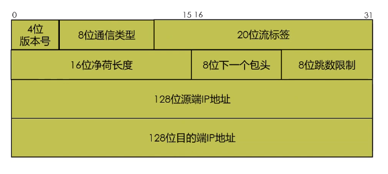 
 

+ 4位的版本号指定了协议的版本。对Ipv6来说，其值是6。
+ 8位的通信类型指示数据流通讯类型或优先级，和这个TOS是类似的。
+ 20位的流标签是Ipv6新增加的字段。对于某些对连接服务质量有特殊要求的通信，比如音频和视频的实时传输数据。16位净荷长度是指Ipv6扩展头部和应用程序之间的和。不包括固定的头部长度。8位的下一个包头（next header）指出紧跟这个固定头部的头部类型。比如扩展头部或者某个上层协议头部。8位的跳数限制（hot limit）和这个TTL相同。
+ 128位也就是16字节来表示IP地址，那么使IP地址的总量达到了2的128次方个。所以说Ipv6使得地球上每一粒沙子都有一个IP地址。32位表示Ipv4地址一般使用点分十进制来表示的。而这个Ipv6的这个地址是用16进制来表示的。

### Ipv6 扩展头部

 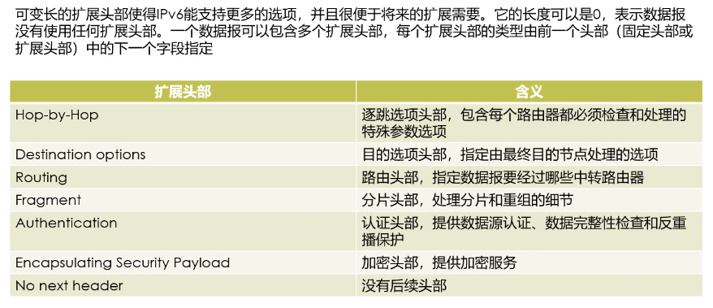 
 

### IP 分片和重组的。并不是用来指示接收顺序的。
当IP数据报长度超过帧的MTU时，它将被分片传输。
分片有可能是发生在发送端也有可能是发生在中转路由器，而且可能会被发生多次分片。但只有在最终的目标机器上才会重新组装。

  
 

IP头部信息中包含三个字段提供了足够多的的信息，除了最后一个分片外，其他部分都要置MF标志。此外每个分片的IP的头部的总长度字段都将设置为该分片的长度。
以太网中的MTU是1500字节，因此它携带IP数据报的数据部分最多是1480字节。因此IP头部占用20字节。
那么考虑到IP数据报封装一个长度为1481字节的ICMP的报文，必须要分片。

例子

 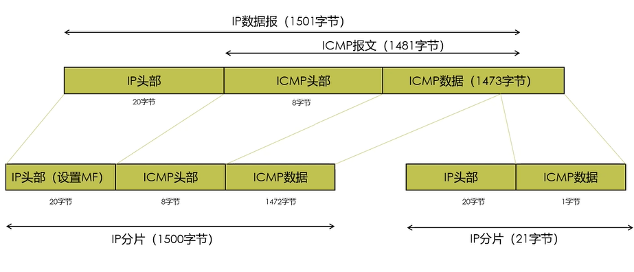 
 

在这个例子里面长度是1501字节的IP数据报被拆分成了两个IP分片，其中一个IP分片长度为1500字节，第二个IP分片的·长度为21字节，那么每个IP分片都包含自己的IP的头部20字节。那么每个Ip分片都包含自己的IP的头部20字节，且第一个IP分片的IP头部被设置了MF标志，而第二个则没有设置该标志，因为它是最后一个分片。

原始的IP数据报中，IP头部的内容被完整的复制到了第一个IP的分片中，而第二个IP分片不包含ICMP的头部信息，因为IP模块重组该ICMP的报文的时候只需要一份信息就足够了，重复并没有益处，
1473字节的ICMP报文的数据前1472字节，被IP模块复制到第一个IP分片中。使其长度达到了1500字节，满足了要求。而最后多出了一个字节被复制到了第二个IP分片。需要指出的是ICMP的报文的头部长度取决于报文的类型。变化范围非常大。

### IP路由
IP路由决定发送数据报到目标机器的路径。IP路由是决定数据报到目标机器的路径。
他是IP协议的一个核心任务。

### IP模块的工作流程

 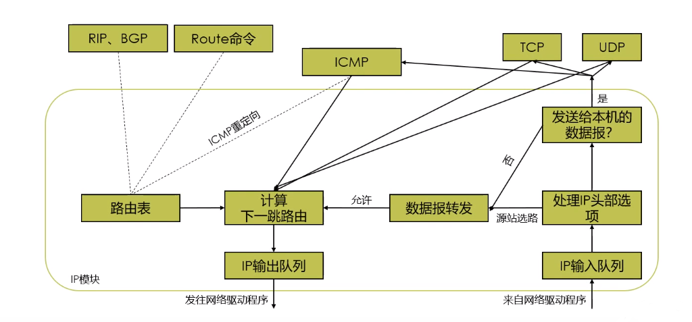 
 

当IP模块接收到了来自数据链路层的IP数据报的时候，它首先对该数据报的头部做CRC的校验。确认无误之后再分析具体信息。如果IP数据报头部设置了源站选路选项，则调用数据报转发子模块来处理数据报。如果IP数据报的投不中的目标IP就是本机的某个IP地址或者是广播地址，则该数据报就是发送给主机的（也就是本机的）。那么这个IP的模块就根据数据报头部中的协议字段来确定，是将派发给哪一个上层的应用，也就是分用。那么如果IP模块发现这个数据报不是发送给本机的，也是调用转发子模块来转发出去，转发子模块首先检测系统是否允许转发，不允许转发就丢弃，如果允许就执行一些操作。它交给IP数据报输出子模块，那么IP数据报应该发送至哪一个下一跳路由呢？以及由哪一个网卡来发送？就是IP的路由过程。也就是这个图里面的计算下一跳路由这一块。IP模块实现了数据报路由的核心的数据结构是路由表。那么这个表按照数据报的目标的IP地址进行分类，同一个类型的IP数据报将被发往相同的下一跳路由器，IP的输出队列，存放的是所有等待发送的数据报，除了需要转发的数据报之外还包括封装了本机的上层数据的IP数据报，那么虚线的箭头的表示路由器表更新的过程，使之更适应最新的网络拓扑的这个结构，被称为IP的路由策略。

### IP路由机制
那么路由表是按照IP地址分类的？给定数据报的目标IP地址，它将匹配路由表的哪一项？

这就是路由机制：
1.查找路由表中和数据报的目标IP地址完全匹配的主机IP地址。如果找到，就是用该路由项，没找到则转2
2.查找路由表中和数据报的目标IP地址具有相同网络ID的网络IP地址。如果找到，就使用该路由项，没找到则转3
3.选择默认路由项，这通常意味着数据报的下一跳是网关

### IP转发
将不是发送给本机的IP数据报交由数据报转发子模块进行转发

对于允许IP数据报转发的文件系统(主机/路由器)，数据报转发子模块将对期望转发的数据报执行以下操作：

1. 检查数据报头部的TTL值。如果TTL为0，则丢弃该数据报

2. 查看数据报头部的严格源路由选择选项。如果该选项被设置，则检测数据报的目标IP地址是否是本机的某个IP地址。如果不是则返回一个ICMP源站选路失败报文

3. 给源端发送一个ICMP重定向报文，以告诉它一个更合适的下一跳路由器（如果有必要）

4. 将TTL值减1

5. 处理IP头部选项

6. 执行IP分片操作（如果有必要）

## 重定向
### ICMP重定向报文
ICMP重定向报文也能用于更新路由表，因此简要讨论ICMP重定向报文

### ICMP 数据结构

 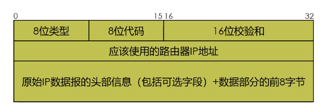 
 

原始IP数据报的头部信息包括可选字段加上数据部分的前8字节，那么ICMP重定向报文的数据部分含义都十分的明确。它给接收方提供了如下两个信息，第一个是引起重定向的IP数据报的源端IP地址，第二个是应该使用路由器的IP地址，接收主机根据这两个信息，就可以断定引起重定向的IP数据报应该是由哪一个路由器来进行转发。并且因此来更新路由表。通常是更新路由表的缓冲而不是直接更改。

【资料】
https://www.bilibili.com/video/av27593391/?p=1
https://blog.csdn.net/doraemon___/article/details/52711221

